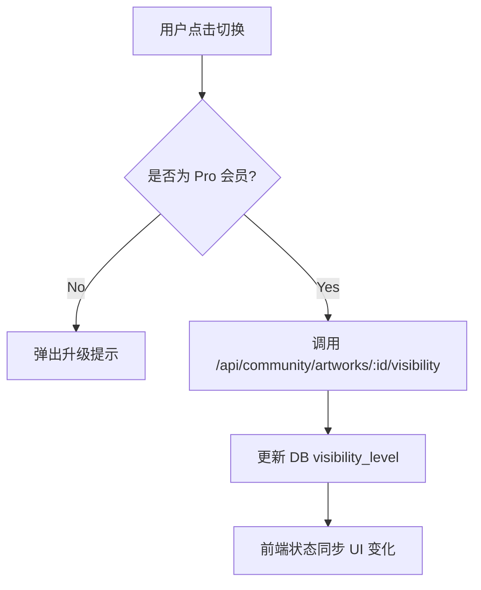

# 图像与视频展示系统 (Artwork Display System)

本文档整理了 AnividAI 系统中对于用户生成内容（Artwork）的展示设计与实现思路，涵盖 Owner 预览管理、社区互动展示以及管理员后台等场景。

## 1. 场景与设计原则

展示系统分为 **Owner 管理模式** 与 **社区社交模式** 两套逻辑，旨在平衡“生产力工具”的便捷性与“社区平台”的互动性。

### 1.1 Owner 预览 (管理模式)
*   **入口**：生成器结果页、My Artworks、OC 详情页。
*   **核心目标**：参数回溯、可见性控制、资源管理。
*   **设计要点**：
    *   展示生成时的完整参数（模型、风格、提示词）。
    *   提供快速操作（可见性切换、删除、下载）。
    *   支持“参数复用 (Reuse)”，实现创作闭环。

### 1.2 社区查看 (社交模式)
*   **入口**：社区页、公共画廊、他人个人主页。
*   **核心目标**：审美发现、社交传播、创作者激励。
*   **设计要点**：
    *   突出展示作者信息（头像、名字、会员等级勋章）。
    *   强调社交反馈（点赞、收藏、分享）。
    *   隐藏敏感参数（除非作者允许复用）。

---

## 2. 核心组件设计

### 2.1 ArtworkCard (两套实现)

| 功能特性 | My Artwork Card (`/artworks/ArtworkCard`) | Community Artwork Card (`/community/ArtworkCard`) |
| :--- | :--- | :--- |
| **主体内容** | 媒体缩略图 (Image/Video) | 媒体内容 (含 OC 专用卡片) |
| **底部信息** | 基础统计 (Like/Fav) | 作者信息 (Avatar/Name/Badge) |
| **主要操作** | **可见性切换 (Globe/Lock)** | **点赞/收藏/分享 (Social Actions)** |
| **权限要求** | Owner & Pro (对于可见性) | 已登录 (对于点赞/收藏) |

### 2.2 ImagePreviewDialog (详情与管理)
作为 Owner 在生成后及管理页看到的核心弹窗：
*   **左侧展示区**：支持 R2 缩略图/原图切换，集成 `LinkingComponent` 展示第三方链接（如 Twitter 联动）。
*   **右侧控制区**：
    *   **参数面板**：列出 Model ID, Style, OC 关联, Prompt。
    *   **快捷工具栏**：
        *   `Plus`：快速开启新创作。
        *   `Share`：弹出社交分享菜单。
        *   `Visibility`：Segmented 控制器切换 Public/Private。
        *   `Copy/Download`：提示词复制与图片下载。
    *   **底部操作**：`Reuse` (带参数跳转回生成器) 与 `Delete`。

---

## 3. 实现流程分析

### 3.1 媒体加载流程
1.  **分级加载**：优先使用 `thumbnail_mobile/desktop` 提升首屏 LCP，点击查看大图或详情时加载 `thumbnail_detail` 或 `image_url`。
2.  **视频预览**：鼠标悬停触发 `video.play()`，展示 4s 短片段预览。
3.  **R2 适配**：通过 `assetLoader` 处理 R2 存储路径到 CDN URL 的转换。

### 3.2 可见性切换逻辑

### 3.3 参数复用 (Reuse) 流程
1.  用户在详情页点击 **Reuse**。
2.  获取当前内容的 `gen_type` (如 anime, video) 和 `uuid`。
3.  构造跳转 URL：`/[locale]/[generator_path]?gen_image_id=[uuid]`。
4.  目标页面通过 `useEffect` 调用 `GET /api/generation/image/:id` 获取原始参数并填充 Form。

---

## 4. 管理员展示场景

管理员页面在社区展示的基础上增加以下能力：
*   **质量评定**：设置 `is_pick` (编辑精选) 提升社区权重。
*   **违规处理**：强制下架 (Private) 或彻底删除。
*   **统计分析**：查看该内容在全站的曝光量、转化率等后端元数据。

---

## 5. 后续优化方向
*   **批量管理**：在 My Artworks 页面支持批量切换可见性或删除。
*   **交互动效**：增加点赞、收藏的微互动动画。
*   **SEO 优化**：为 Public 的 Artwork 自动生成对应的 Meta Tags 页面。
