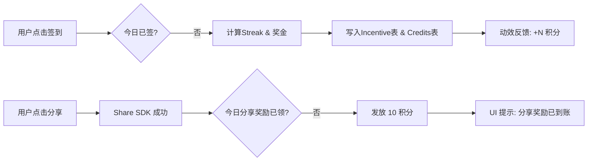

# 用户激励系统实现方案 (User Incentives)

## 1. 核心逻辑设计

### 1.1 签到奖励 (Check-in)

采用 30 天周期阶梯奖励：

- **基础奖励**: 10/日（展示为 MC 图标）
- **循环奖励**:
  - 第 5 天 (+10=20)
  - 第 10 天 (+30=40)
  - 第 30 天 (+60=70)
- **中断处理**: 连续中断则计数重置为 1

### 1.2 分享奖励 (Share)

- **额度**: 10 MC/次
- **限制**: 每日 1 次，基于现有 `ShareMenu` 触发成功回调后调用后端
- **行为判定**: 只对 Twitter/Facebook/Reddit 等真实分享触发奖励，复制链接（含 Web Share 降级到剪贴板）仅提供便捷传播，不参与奖励计数，避免用户通过复制获利。
- **状态同步**: `ShareMenu` 组件在用户登录后请求 `/api/incentive/status`；底部提示展示 `Daily {已领取}/{上限}`，同一 UTC 日内已领取则不再调用领取接口，彻底阻断重复积分。

### 1.3 奖励有效期 (Credit Expiration)

- 签到奖励与分享奖励发放时必须写入 `credits.expired_at`
- 当前口径：激励积分有效期为 1 个月（与定价规则一致）

## 2. 数据库设计

新增 `user_incentives` 表记录行为明细。

```typescript
// src/db/schema.ts
export const userIncentives = pgTable(
  "user_incentives",
  {
    id: integer().primaryKey().generatedAlwaysAsIdentity(),
    user_uuid: varchar({ length: 255 }).notNull(),
    type: varchar({ length: 50 }).notNull(), // 'check_in', 'share_sns'
    reward_amount: integer().notNull(),
    reward_date: date().notNull(), // UTC date (YYYY-MM-DD) for daily idempotency
    streak_count: integer().default(0), // 针对签到的连续天数
    metadata: jsonb(), // 存储如分享平台、页面ID等
    created_at: timestamp({ withTimezone: true }).defaultNow(),
  },
  (table) => [
    uniqueIndex("unique_user_incentive_daily").on(
      table.user_uuid,
      table.type,
      table.reward_date,
    ),
    index("idx_user_incentives_user_type_date").on(
      table.user_uuid,
      table.type,
      table.created_at,
    ),
  ],
);
```

## 3. UI/UX 方案

### 3.1 Header 签到组件

- **位置**: `LocaleToggle` 左侧
- **视觉**:
  - 默认展示日历图标 + 今日状态
  - 奖励单位使用 MC 图标展示，使用 `getCreamyCharacterUrl("meow_coin")`，不再显示 MC 文案
  - 点击弹出 Popover 展示 **进度条 (Progress Bar)**
  - 第 5/10/30 天使用宝箱或高亮图标表示“大奖”
  - 点击签到使用 `framer-motion` 实现积分跳出动效

### 3.2 分享组件优化

- 在 `ShareMenu` 底部增加提示：`Share to get +10 credits (Daily {used}/1)`，展示 `/api/incentive/status` 返回的 `hasReceivedToday` 结果
- 成功分享后触发 `confetti` 效果并实时更新 Header 积分
- 成功后增加一条记录到 `user_interactions`表，类型为share

## 4. 流程图



## 5. 实现清单

1. [ ] 数据库迁移：新增 `reward_date` + `unique_user_incentive_daily`（迁移：`src/db/migrations/0006_add_user_incentives_reward_date.sql`）
2. [ ] 后端 Service: `src/services/incentive.ts` 处理幂等发放
3. [ ] 签到组件: `src/components/incentive/CheckInButton.tsx`
4. [ ] 集成到 `AppHeader`
5. [ ] 增强 `ShareMenu.tsx` 逻辑

## 6. 变更历史

- 2026-02-07 FEAT-user-incentives 修复签到/分享奖励未写入 `expired_at` 导致余额不生效（影响：`src/services/incentive.ts`）
- 2026-01-26 FEAT-user-incentives 同步签到与分享奖励额度（签到: 10/20/30/70, 分享: 10）
- 2026-01-22 FEAT-user-incentives 更新签到阶梯奖励数值（5天:30, 10天:50, 30天:100）
- 2026-01-18 FEAT-user-incentives 分享奖励计数修复（影响：前端 ShareMenu）
