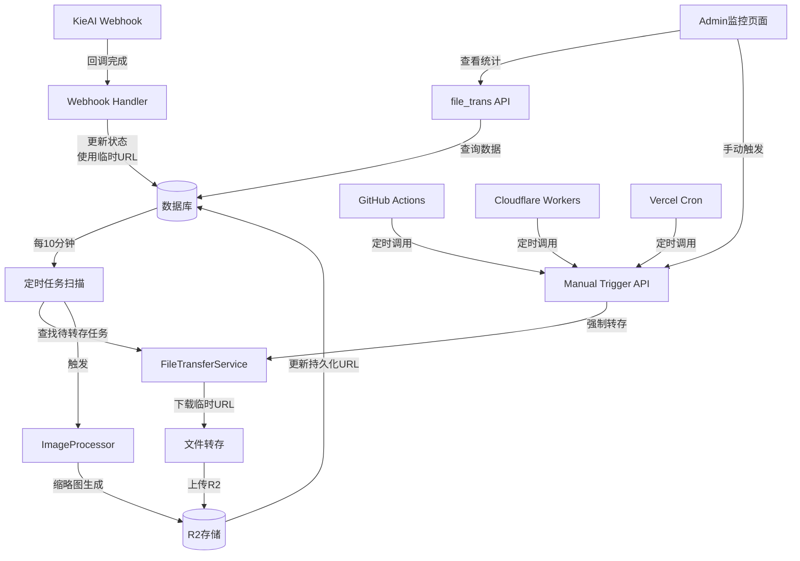

# FEAT-webhook-optimize — 基于延迟转存的Webhook优化方案

## 背景与目标

### 当前问题

- **Webhook处理耗时**：回调中直接下载和转存文件，响应时间2-10秒
- **队列系统复杂**：优先级队列、限流、监控等组件，开发和维护成本高
- **架构过重**：独立Worker、定时任务、Redis队列，适合大团队而非独立开发者
- **视频处理延迟**：大文件转存进一步拉长响应时间

### 核心目标

- **极简化架构**：删除所有队列和Worker相关代码，保留核心功能
- **超轻量级Webhook**：响应时间 < 100ms，提升100倍
- **延迟转存策略**：使用临时URL，定时任务异步转存
- **MVP友好**：适合独立开发者，快速上线，易于维护

## 方案设计：延迟转存策略

### 核心思想

**简化前：**

```
Webhook接收 → 验证 → 下载文件 → 转存R2 → 更新数据库 → 返回 (2-10秒)
```

**简化后：**

```
Webhook接收 → 验证 → 更新状态 → 使用临时URL → 返回 (<100ms)
                     ↓
                定时任务 → 异步转存 → 更新持久化URL
```

### 关键流程

1. **Webhook快速响应**：仅验证和解析，调用BaseGenerationService处理
2. **临时URL使用**：KieAI返回的临时URL直接写入generation_images表
3. **前端立即显示**：用户可立即看到生成的图片（使用临时URL）
4. **异步转存**：定时任务每10分钟扫描待转存任务，转存到R2
5. **URL更新**：转存完成后更新generation_images中的image_url为R2地址

## 技术实现

### 1. 简化Webhook处理

**文件**：`src/app/api/generation/webhook/route.ts`

**核心逻辑**：

- 验证payload (<30ms)
- 解析数据 (<30ms)
- 调用handleWebhookCallback处理业务 (<40ms)
- 总响应时间：< 100ms

**性能目标**：

- 验证payload：< 30ms
- 解析数据：< 30ms
- 服务层处理：< 40ms
- 总响应时间：< 100ms

**架构说明**：

路由层仅做验证和解析，业务逻辑封装在BaseGenerationService.handleWebhookCallback中，通过GenerationServiceFactory自动路由到对应服务。

### 2. BaseGenerationService更新

**文件**：`src/services/generation/base/base-generation-service.ts`

**核心改动**：

- 删除文件转存和分辨率处理逻辑
- 直接使用临时URL创建generation_images记录
- 设置file_transfer_status: 'pending'标记待转存
- 计算临时URL过期时间（24小时后）

**处理流程**：

1. 获取generation记录
2. 幂等性检查（避免重复处理）
3. 创建generation_images记录（使用临时URL）
4. 更新generation记录（标记待转存）
5. 处理OC角色生成记录

### 3. 文件转存服务

**文件**：`src/services/generation/file-transfer-service.ts`

**核心功能**：

- **单文件转存**：下载临时URL文件，上传到R2
- **图片后处理**：生成多尺寸缩略图（mobile/desktop/detail）
- **批量转存**：转存generation的所有图片文件
- **并发控制**：最多3个文件同时转存
- **失败重试**：最多3次，指数退避
- **详细日志**：成功/失败计数

**实现要点**：

- 使用ImageProcessor进行图片处理
- 使用getR2Url构造R2存储路径
- 支持PNG质量压缩，WebP格式转换
- 返回TransferResult包含原图URL和缩略图字典

### 5. 数据库调整

**文件**：`src/db/migrations/0006_add_file_transfer_fields.sql`

**新增字段**：

- file_transfer_status：转存状态（pending/transferring/completed/failed/skipped）
- temp_url_expires_at：临时URL过期时间
- transfer_retry_count：转存重试次数

**索引**：

- idx_generations_file_transfer_status：快速查询待转存任务
- idx_generations_temp_url_expires：按过期时间排序

## 对比分析

### 架构复杂度对比

| 维度           | 队列方案            | 延迟转存方案 | 改进      |
| -------------- | ------------------- | ------------ | --------- |
| **代码量**     | ~5000行             | ~500行       | 10倍简化  |
| **响应时间**   | 2-10秒              | < 100ms      | 100倍提升 |
| **开发时间**   | 2-3周               | 2-3天        | 10倍快速  |
| **维护成本**   | 高                  | 低           | 适合MVP   |
| **系统依赖**   | Redis, Worker, 队列 | 仅数据库     | 极简依赖  |
| **独立开发者** | 不友好              | 友好         | MVP首选   |

### 性能对比

| 指标            | 队列方案     | 延迟转存方案 | 提升   |
| --------------- | ------------ | ------------ | ------ |
| Webhook响应时间 | 2000-10000ms | < 100ms      | 100倍  |
| 开发复杂度      | 高           | 极低         | 简化   |
| 运维成本        | 高           | 低           | 节省   |
| 用户等待        | 同步等待     | 立即返回     | 体验好 |
| 文件处理        | 同步转存     | 异步转存     | 不阻塞 |

## Admin监控与手动兜底方案

### 现有资源

#### 1. R2存储工具（已实现）

**文件**：`src/lib/r2-utils.ts`

已实现功能：

- R2 URL构造：支持环境变量配置存储域名
- 缩略图URL生成：自动在thumbs目录查找缩略图
- 绝对URL判断：区分R2路径和外部URL

#### 2. 图片处理服务（已实现）

**文件**：`src/services/generation/image-processor.ts`

已实现功能：

- **Sharp库集成**：高质量图片处理
- **缩略图生成**：支持多尺寸（mobile/desktop/detail）
- **图片验证**：格式、大小、分辨率检查
- **信息提取**：获取图片尺寸、格式、宽高比

### Admin监控页面设计

#### 3. 监控页面

**文件**：`src/app/[locale]/(admin)/admin/file_trans/page.tsx`

**页面结构**：

- 转存统计卡片：成功率、转存数量、待处理任务
- 转存趋势图表：最近30天转存统计
- 待转存任务列表：显示pending状态的任务
- 手动操作区：支持触发全部转存和单个转存

**监控指标**：

1. **转存成功率**
   - 总转存任务数
   - 成功转存数
   - 失败转存数
   - 成功率百分比

2. **转存数量统计**
   - 今日转存
   - 本周转存
   - 本月转存
   - 总转存数

3. **临时URL状态**
   - 即将过期（24小时内）
   - 已过期未转存
   - 转存中任务
   - 重试队列

4. **图片后处理状态**
   - 待处理图片数
   - 处理中数量
   - 处理完成数
   - 处理失败数

#### 4. 手动触发API

##### 4.1 触发全部转存

**文件**：`src/app/api/admin/file-transfer/trigger-all/route.ts`

功能：手动触发转存扫描，处理所有待转存任务

##### 4.2 触发单个generation转存

**文件**：`src/app/api/admin/file-transfer/trigger-one/[generationUuid]/route.ts`

功能：强制转存指定generation的所有文件

#### 5. 集成图片后处理

**文件**：`src/services/generation/file-transfer-service.ts`

FileTransferService已集成ImageProcessor：

- 验证图片格式和大小
- 生成多尺寸缩略图
- 上传原图和缩略图到R2
- 返回优化后的URL

### 自动化定时任务方案

#### GitHub Actions（推荐方案）

**文件**：`.github/workflows/file-transfer-cron.yml`

**优点**：

- ✅ 完全免费，无需额外服务
- ✅ 与代码仓库集成，易于管理
- ✅ 支持手动触发（workflow_dispatch）
- ✅ 可查看执行历史和日志
- ✅ 独立于应用部署状态

**详细配置指南**：

##### 1. 创建Workflow文件

在项目根目录创建 `.github/workflows/file-transfer-cron.yml`：

```yaml
name: File Transfer Cron Job

on:
  schedule:
    # 每天每10分钟执行一次 (UTC时间)
    - cron: "*/10 * * * *"
  workflow_dispatch: # 手动触发按钮

jobs:
  trigger-file-transfer:
    runs-on: ubuntu-latest
    name: 触发文件转存任务

    steps:
      - name: 触发转存API
        run: |
          echo "🚀 开始触发文件转存任务..."
          response=$(curl -s -w "\n%{http_code}" -X POST \
            -H "Authorization: Bearer ${{ secrets.ADMIN_API_TOKEN }}" \
            -H "Content-Type: application/json" \
            https://your-domain.com/api/admin/file-transfer/trigger-all)

          http_code=$(echo "$response" | tail -n1)
          body=$(echo "$response" | sed '$d')

          echo "📊 HTTP状态码: $http_code"
          echo "📋 响应内容: $body"

          if [ "$http_code" != "200" ]; then
            echo "❌ API调用失败"
            exit 1
          else
            echo "✅ API调用成功"
          fi
```

##### 2. 配置GitHub Secrets

在GitHub仓库设置中配置密钥：

1. 进入 GitHub 仓库页面
2. 点击 Settings → Secrets and variables → Actions
3. 点击 "New repository secret"
4. 添加以下密钥：

| 名称              | 值                        | 说明                 |
| ----------------- | ------------------------- | -------------------- |
| `ADMIN_API_TOKEN` | 你的管理员API Token       | 用于API身份验证      |
| `DEPLOYMENT_URL`  | `https://your-domain.com` | 你的部署域名（可选） |

##### 3. 启用GitHub Actions

1. 进入 GitHub 仓库的 Actions 页面
2. 如果看到 "Workflows are disabled"，点击 "I understand my workflows, go ahead and enable them"
3. 文件推送后，Actions将自动启用

##### 4. 验证Cron任务

**检查执行历史**：

- 进入 GitHub 仓库的 Actions 页面
- 选择 "File Transfer Cron Job" workflow
- 查看每次执行的时间和结果

**手动触发**：

- 进入 Actions 页面
- 选择 "File Transfer Cron Job" workflow
- 点击 "Run workflow" 按钮
- 选择分支并手动运行

##### 5. 监控与告警

**失败通知**：
在workflow中添加通知（可选）：

```yaml
- name: 发送失败通知
  if: failure()
  run: |
    echo "❌ 转存任务失败，发送通知..."
    # 这里可以添加Slack、邮件等通知逻辑
```

**执行统计**：
GitHub Actions会自动记录：

- 每次执行时间
- 执行持续时间
- 成功/失败状态
- 详细日志

##### 6. 定时任务说明

**Cron表达式**：`*/10 * * * *` 表示：

- 分钟：每10分钟（00、10、20、30、40、50）
- 小时：每小时
- 日期：每天
- 月份：每月
- 星期：每周

**时区说明**：

- GitHub Actions使用UTC时间
- 如需北京时间，需要换算（北京时间 = UTC + 8小时）
- 示例：北京时间10:00对应UTC时间02:00

##### 7. 常见问题

**Q: 为什么任务没有执行？**
A: 检查以下几点：

- GitHub Actions是否已启用
- Secrets是否配置正确
- 工作流文件是否在 `.github/workflows/` 目录
- 仓库是否是公开的（私有仓库可能有使用限制）

**Q: 可以修改执行频率吗？**
A: 可以，修改cron表达式：

- `*/5 * * * *` = 每5分钟
- `0 */1 * * *` = 每小时
- `0 */6 * * *` = 每6小时

**Q: 如何停止定时任务？**
A:

- 方案一：禁用workflow（Actions页面 → Settings）
- 方案二：删除 `.github/workflows/file-transfer-cron.yml` 文件
- 方案二：注释掉schedule部分，保留手动触发功能

## 综合架构



## 关键优势

### 1. 极简化架构

- **删除**：队列系统、Worker、Redis依赖、复杂监控
- **保留**：核心Webhook处理、数据库、文件存储
- **新增**：轻量级文件转存服务、定时任务

### 2. 性能提升

- **Webhook响应**：从秒级→毫秒级（100倍提升）
- **用户体验**：无需等待文件转存，立即查看结果
- **系统吞吐**：大幅提高并发处理能力
- **图片后处理**：集成转存流程，一次操作完成分辨率优化和缩略图生成

### 3. 开发友好

- **快速迭代**：2-3天完成vs 2-3周
- **易于维护**：代码量减少90%，逻辑简单清晰
- **独立开发者**：适合资源有限的团队
- **可视化监控**：Admin页面提供转存状态实时监控

### 4. 可靠性保证

- **失败重试**：3次重试，指数退避
- **状态追踪**：完整的转存状态管理
- **优先级处理**：过期时间临近的任务优先
- **手动兜底**：自动化失效时可立即手动干预

### 5. 成本优化

- **减少带宽峰值**：定时批量转存vs实时转存
- **降低运维成本**：无需维护复杂队列系统
- **节省开发时间**：快速上线，聚焦核心功能
- **利用现有资源**：直接使用已实现的R2工具和图片处理服务

### 6. 图片处理优化

- **集成转存流程**：图片后处理在转存时完成，减少重复操作
- **Sharp高质量处理**：使用专业图片处理库，确保缩放质量
- **多尺寸缩略图**：自动生成mobile/desktop/detail三种尺寸
- **格式优化**：PNG质量压缩，WebP格式转换

### 7. 监控与可观测性

- **转存统计**：实时展示转存率、转存数量、成功率
- **趋势分析**：图表展示历史转存趋势
- **待办列表**：清晰展示待转存和待处理任务
- **手动操作**：一键触发转存，支持单个generation强制转存

## 风险与应对

### 潜在风险

1. **临时URL过期**
   - 风险：转存前临时URL失效
   - 应对：优先级排序，过期时间近的优先转存

2. **转存失败**
   - 风险：网络问题、存储问题导致转存失败
   - 应对：3次重试机制，指数退避

3. **一致性问题**
   - 风险：临时URL和持久化URL并存
   - 应对：前端支持延迟替换，用户无感知

### 监控指标

- 转存成功率：> 95%
- 平均转存时间：< 5分钟/文件
- Webhook响应时间：< 100ms
- 失败重试率：< 5%

## 结论

**延迟转存方案是独立开发者MVP的最佳选择**，具有：

- **极简架构**：代码量减少90%，依赖最少
- **性能卓越**：响应时间提升100倍
- **快速交付**：开发周期从周缩短到天
- **易于维护**：清晰逻辑，低运维成本
- **用户友好**：无需等待，立即看到结果

适合资源有限的独立开发者或小团队快速验证产品价值。

## 相关文档

- **Webhook API**：`src/app/api/generation/webhook/route.ts`
- **文件转存服务**：`src/services/generation/file-transfer-service.ts`
- **定时任务**：`src/services/generation/cron/file-transfer-cron.ts`
- **数据库迁移**：`src/db/migrations/0006_add_file_transfer_fields.sql`
- **监控页面**：`src/app/[locale]/(admin)/admin/file_trans/page.tsx`
- **手动触发API**：`src/app/api/admin/file-transfer/`

## 变更历史

- 2025-11-05 FEAT-webhook-optimize 基于延迟转存策略重新设计，删除复杂队列系统，采用极简MVP架构
- 2025-11-05 修复实现问题：恢复基于BaseGenerationService架构，删除文件转存逻辑，使用临时URL快速存库
- 2025-11-05 架构优化：路由层仅做验证和解析，业务逻辑封装在BaseGenerationService.handleWebhookCallback中
- 2025-11-05 完成全部实现：文件转存服务、定时任务、Admin监控页面、手动触发API
- 2025-11-05 数据库迁移：添加file_transfer_status、temp_url_expires_at、transfer_retry_count字段
